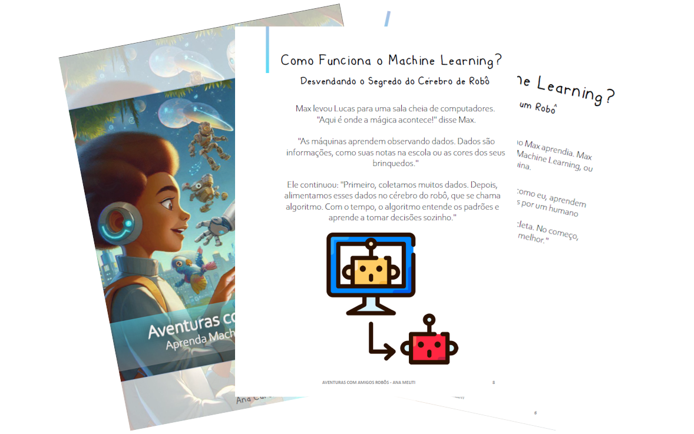

<h2 align="center"> 
   Projeto:"Ebook do zero com ferramentas IAs"</h2>
   

 

-----

-----

 > ℹ️ **NOTE:** Repositório onde desenvolvemos durante o bootcamp oferecido pela [DIO](www.dio.com.br) e instruidos pelo Felipe Aguiar

------

## 💻 Tecnologias utilizadas

 
 

  
- ## 🧠 Prompts
ChatGPT：

|   Ação   | prompt                                                                                                                                                                                                                                                                         |
| :------: | ------------------------------------------------------------------------------------------------------------------------------------------------------------------------------------------------------------------------------------------------------------------------------ |
|  Título  | Crie um título de um ebook sobre o tema de Machine Learning para o público-alvo crianças de 6 até 12 anos, onde o nicho é ciência de dados e subnicho Machine Learning, o título deve ser chamativo e curto e tenha uma temática lúdica, me liste cinco variações de títulos.                                                         |
| Conteúdo | Faça um texto para ebook , com foco em Machine Learning, listando o que é e como funciona {REGRAS} O título do ebook é “Aventuras com amigos robôs: Aprenda Machine Learning brincando, faça em forma de história, explique sempre de uma maneira simples, sempre traga exemplos com base na história |

Copilot：

|  Ação  | prompt                                                                                 |
| :----: | -------------------------------------------------------------------------------------- |
| Título | Criar uma imagem sobre Aventuras na Fábrica dos Robôs Inteligentes para crianças de 6 até 12 anos. |

## ✨ Features

- Conteúdo gerado via ChatGPT
- Imagens geradas via Copilot

## 📚 Materiais

- Imagens utilizadas em `assets`
- ebook gerado durante as aulas em `output`
